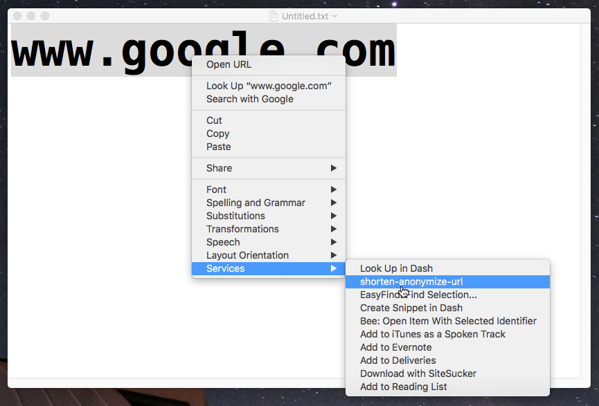

# shorten-anonymize-url []() [](https://npmjs.com/package/shorten-anonymize-url) [](https://npmjs.com/package/shorten-anonymize-url) [](https://npmjs.com/package/desktop-dimmer)

------

<p align="center">
  <b>Shorten and anonymize (<a href="https://en.wikipedia.org/wiki/URL_redirection#Removing_referer_information">derefer</a>)</b> URLs at the same time.<br>
   Supports Commandline and programmatic usage.<br>
  Uses <a href="https://goo.gl">goo.gl</a>, <a href="https://bit.ly">bit.ly</a> and <a href="https://anonym.to">anonym.to</a> under the hood.<br><br>
  <b>Enables right-click URL shortening on macOS.</b><br>
  Includes the required <a href="https://en.wikipedia.org/wiki/List_of_macOS_components#Automator">Automator Service</a> and installation toolset.<br><br>
  Available for macOS, Windows and Linux.
</p>

------


## Contents

1. [Commandline Usage](#commandline_usage)
1. ['Right-Click' URL Shortener (macOS)](#right-click_url_shortener_(macos))
1. [Programmatic Usage](#programmatic_usage)
1. [Platform Support](#platform_support)
1. [Roadmap](#roadmap)
1. [Contribute](#contribute)
1. [Author](#author)


## <a name="commandline_usage"/></a> Commandline Usage

### Installation

```bash
$ npm install --global shorten-anonymize-url
```

### Usage

```bash
$ shorten-anonymize-url "<url>"
```

⚠️ Enclose URLs in quotes to handle special characters like as question marks ⚠️

### Show Help and Options

```bash
$ shorten-anonymize-url --help
```

### Example

```bash
$ shorten-anonymize-url "https://www.google.de/?gfe_rd=cr&ei=WDE4We-3BcfPXr7dpdgH&gws_rd=ssl"
>> http://bit.ly/2sglJKg
```


## <a name="right-click_url_shortener_(macos)"/></a> Right-Click URL Shortener (macOS only)




The module includes a global [Service](https://www.macosxautomation.com/services/) for macOS [Automator](https://en.wikipedia.org/wiki/List_of_macOS_components#Automator), as well as an automated installation and uninstallation routine.

### Features

The global shortener service does the following:

 1. It takes any marked url within macOS,
 1. shortens and anonymizes it,
 1. copies the resulting shortened and anonymized URL to the macOS clipboard.

This enables global url shortening and anonymizing.

### Compatibility

The global nature of macOS Services makes this module available to nearly all macOS apps, such as [Safari](https://www.apple.com/safari/), [Finder](https://en.wikipedia.org/wiki/Finder_(software)), [Google Chrome](https://www.google.de/chrome/browser/desktop/) or [Microsoft Office for Mac](https://products.office.com/en-us/mac/microsoft-office-for-mac).

### Requirements for the macOS Service

Install [the commandline module](#commandline-use).

### Install the macOS Service

Run the commandline module with the **--service-install** argument:

```bash
$ shorten-anonymize-url --service-install
```

### Uninstall the macOS Service

Run the commandline module with the **--service-uninstall** argument:

```bash
$ shorten-anonymize-url --service-uninstall
```

### Use the macOS Service

1. Mark any URL (or any text),
1. right-click,
1. open the 'Services' menu,
1. Click 'shorten-anonymize-url'

The clipboard now contains the shortened and anonymized URL.

## <a name="programmatic_usage"/></a> Programmatic Usage

### Installation

```bash
$ npm install --save shorten-anonymize-url
```

### API

The module returns a `Function` which takes 3 arguments and returns a `Promise`:

```js
const shortenAnonymizeUrl = require('shorten-anonymize-url')
shortenAnonymizeUrl(url, bitlyKey, googlKey)
.then((shorturl) => {
    console.log(shorturl);
})
```

 - **url** *String* - Bundle identifier for the callback function
 - **bitlyKey** [optional] *String* - bit.ly API key
 - **googlKey** [optional] *String* - goo.gl API key

The `Promise` resolves with:

 - **shorturl** *String* - **Shortened anonymised bit.ly url**

### Example

```js
const shortenAnonymizeUrl = require('shorten-anonymize-url')
shortenAnonymizeUrl('reddit.com')
.then((url) => {
    console.log(url);
    // http://bit.ly/2qWTDzM
})
.catch((err) => {
    console.error(err);
})
```


## <a name="platform_support"/></a> Platform Support

Tested on:

- macOS Sierra
- Windows 10 Anniversary
- Ubuntu 17.10

Global 'Right-Click' url shortening only supported on macOS for now.


## <a name="roadmap"/></a> Roadmap 

- [ ] Global Right-Click URL shortening for Windows + Linux
- [ ] CI-based automated Testing


## <a name="contribute"/></a> Contribute 

Read the [contribution documentation](https://github.com/sidneys/shorten-anonymize-url/blob/release/CONTRIBUTING.md) first.

- [Dev Chat](http://gitter.im/sidneys/shorten-anonymize-url): Talk about features and suggestions.
- [Issues](http;//github.com/sidneys/shorten-anonymize-url/issues) File bugs and document issues.


## <a name="author"/></a> Author

[sidneys](http://sidneys.github.io) 2017


